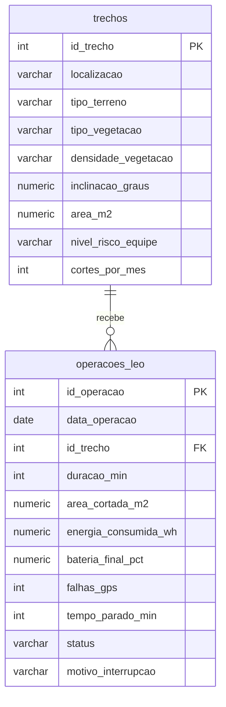

# FieldTech Engineering Challenge – MOTIVA / CCR
## Data Science · Sprint 3 – SQL aplicado ao Challenge

Banco de dados em **PostgreSQL** que organiza os dados de operação do **LEO (Lawn Engineering Operator)**, o robô autônomo de corte de grama do nosso projeto, para responder perguntas que a Motiva/CCR precisa resolver antes de implantá-lo.

## Integrantes

| Nome | RM |
|---|---|
| André Henrique Mendes da Cunha | 564602 |
| Guilherme Meira dos Santos | 566331 |
| Gustavo Nobre Coppola | 561423 |
| Pedro Augusto Pioli da Costa Duarte | 564085 |
| Pedro Sinnes Martinez | 566017 |
| Raphael Martins Coutinho | 565359 |

---

## 1. Contexto do projeto e conexão com o Challenge

**Problema:** a roçada da vegetação nas faixas de domínio das rodovias precisa ser feita com frequência e expõe as equipes de campo a áreas de risco, como canteiros centrais próximos ao tráfego e taludes íngremes.

**Nossa solução:** o **LEO**, um robô 6WD (700 × 500 × 250 mm) com corte por fio de nylon, controlado remotamente, com ESP32, GPS, câmera FPV e painel solar.

**O que vimos nas Sprints anteriores:** o desempenho do robô muda conforme o **tipo de terreno** e a **densidade da vegetação**.

**O que esta Sprint faz:** transforma essa análise em um banco relacional simples (2 tabelas) e usa SQL para responder **decisões reais da empresa**, e não consultas genéricas:

| # | Decisão da empresa | Consulta |
|---|---|---|
| Q1 | Por onde começar a implantação do LEO? | Produtividade por trecho |
| Q2 | Em quais trechos de risco alto já dá para tirar a equipe do campo? | Desempenho do LEO em trechos de risco alto |
| Q3 | Quantos robôs e horas por mês são necessários? | Horas de operação por trecho |
| Q4 | O que corrigir no LEO antes da implantação? | Motivos de interrupção |
| Q5 | Bateria e painel solar estão bem dimensionados? | Trechos com bateria crítica |

> **Sobre os dados:** são **simulados**, porém coerentes com o problema (trechos típicos de rodovia, produtividade que cai com inclinação e densidade da vegetação, consumo de energia proporcional à dificuldade do terreno, falhas de GPS, patinagem, fio enroscado). Premissa de energia: bateria de **480 Wh**, com o LEO interrompendo a operação abaixo de 15%. Para reproduzir os mesmos resultados, use os arquivos deste repositório.

## 2. Estrutura do repositório

```
├── README.md
├── fieldtech_sprint3.sql      # criação das tabelas, carga (INSERT) e as 5 consultas comentadas
├── dados/
│   ├── trechos.csv
│   └── operacoes_leo.csv
└── prints/                    # prints das consultas rodando no PostgreSQL
```

## 3. Estrutura do banco de dados



| Tabela | Descrição | Registros |
|---|---|---|
| `trechos` | Trechos de rodovia onde o LEO poderia atuar: terreno, vegetação, inclinação, área, **nível de risco para a equipe** e **frequência de roçada por mês** exigida. | 8 |
| `operacoes_leo` | Cada saída de corte do LEO em um trecho (1 trecho → N operações): duração, área cortada, energia, bateria final, falhas de GPS, tempo parado, status e motivo da interrupção. | 48 |

**Produtividade (m²/h)** = `area_cortada_m2 / (duracao_min / 60)`

### Como reproduzir

```bash
createdb fieldtech
psql -d fieldtech -f fieldtech_sprint3.sql
```

O script recria as tabelas, insere os dados e executa as consultas Q1 a Q5. Como alternativa aos `INSERT`, os CSVs da pasta `dados/` podem ser importados com `\copy` (comandos comentados no `.sql`).

---

## 4. Perguntas, consultas e análises

### Q1 – Em quais trechos o LEO é mais produtivo? (define por onde começar a implantação)

**Decisão que apoia:** Escolher o trecho piloto e o ranking de implantação do LEO.

**Consulta SQL:**

```sql
SELECT t.localizacao,
       t.tipo_terreno,
       t.tipo_vegetacao,
       COUNT(o.id_operacao)                                       AS qtd_operacoes,
       ROUND(AVG(o.area_cortada_m2 / (o.duracao_min / 60.0)), 1)  AS produtividade_media_m2_h
FROM operacoes_leo o
JOIN trechos t ON t.id_trecho = o.id_trecho
GROUP BY t.id_trecho, t.localizacao, t.tipo_terreno, t.tipo_vegetacao
ORDER BY produtividade_media_m2_h DESC;
```

**Print:** 

**Resultado:**

| localizacao | tipo_terreno | tipo_vegetacao | qtd_operacoes | produtividade_media_m2_h |
|---|---|---|---|---|
| Praça de pedágio km 47 | Plano | Grama rasteira | 6 | 270.2 |
| Canteiro central km 12 | Plano | Grama rasteira | 6 | 254.5 |
| Faixa lateral km 18 | Plano | Grama alta | 6 | 182.5 |
| Acesso de serviço km 62 | Irregular | Grama alta | 6 | 168.4 |
| Faixa de domínio km 55 | Irregular | Vegetação mista | 6 | 158.0 |
| Talude km 25 | Talude | Grama alta | 6 | 143.1 |
| Área de escape km 31 | Irregular | Mato denso | 6 | 97.6 |
| Talude km 40 | Talude | Mato denso | 6 | 62.0 |

**Interpretação:** O LEO rende de **270 m²/h** na praça de pedágio km 47 a **62 m²/h** no Talude km 40, uma diferença de mais de **4 vezes**. Os quatro primeiros colocados são terrenos planos ou de inclinação moderada com grama; os dois piores são os de **mato denso**, e o Talude km 40 ainda soma inclinação de 22°. Para a empresa, isso mostra que a área do trecho não basta para prever prazo e custo de roçada: o tipo de terreno e de vegetação muda o tempo de operação de forma grande. O ranking indica onde o robô entrega resultado já na primeira fase e onde ainda precisa evoluir.

---

### Q2 – Nos trechos de risco ALTO para as equipes de campo, o LEO já consegue assumir o corte? (quais trocar primeiro)

**Decisão que apoia:** Definir quais trechos de risco alto podem ter a equipe humana substituída primeiro.

**Consulta SQL:**

```sql
SELECT t.localizacao,
       COUNT(o.id_operacao)                                              AS qtd_operacoes,
       ROUND(AVG(o.area_cortada_m2 / (o.duracao_min / 60.0)), 1)         AS produtividade_media_m2_h,
       ROUND(100.0 * COUNT(*) FILTER (WHERE o.status = 'Concluída')
             / COUNT(*), 0)                                              AS pct_operacoes_concluidas
FROM operacoes_leo o
JOIN trechos t ON t.id_trecho = o.id_trecho
WHERE t.nivel_risco_equipe = 'Alto'
GROUP BY t.id_trecho, t.localizacao
ORDER BY pct_operacoes_concluidas DESC, produtividade_media_m2_h DESC;
```

**Print:** 

**Resultado:**

| localizacao | qtd_operacoes | produtividade_media_m2_h | pct_operacoes_concluidas |
|---|---|---|---|
| Canteiro central km 12 | 6 | 254.5 | 83 |
| Área de escape km 31 | 6 | 97.6 | 83 |
| Talude km 25 | 6 | 143.1 | 67 |
| Talude km 40 | 6 | 62.0 | 17 |

**Interpretação:** Filtramos só os trechos em que a equipe de campo corre mais risco (tráfego e taludes), que são justamente os que motivam o projeto. O **Canteiro central km 12** é o melhor candidato para começar: risco alto, **254,5 m²/h** e **83% das operações concluídas**. A Área de escape km 31 também conclui 83% das operações, porém em ritmo mais lento (97,6 m²/h). O **Talude km 40** é o oposto: só **17%** das operações foram concluídas, então ainda não é seguro contar com o LEO ali sozinho. A empresa ganha um critério objetivo (risco × desempenho) para decidir onde tirar pessoas do campo primeiro e onde ainda manter a equipe humana.

---

### Q3 – Quantas horas de operação do LEO cada trecho exige por mês? (dimensiona a frota e a agenda)

**Decisão que apoia:** Dimensionar quantos robôs e quantas horas de operação por mês a implantação exige.

**Consulta SQL:**

```sql
SELECT t.localizacao,
       t.area_m2,
       t.cortes_por_mes,
       ROUND(AVG(o.area_cortada_m2 / (o.duracao_min / 60.0)), 1)                   AS produtividade_media_m2_h,
       ROUND(t.area_m2 * t.cortes_por_mes
             / AVG(o.area_cortada_m2 / (o.duracao_min / 60.0)), 1)                 AS horas_leo_por_mes
FROM trechos t
JOIN operacoes_leo o ON o.id_trecho = t.id_trecho
GROUP BY t.id_trecho, t.localizacao, t.area_m2, t.cortes_por_mes
ORDER BY horas_leo_por_mes DESC;
```

**Print:** 

**Resultado:**

| localizacao | area_m2 | cortes_por_mes | produtividade_media_m2_h | horas_leo_por_mes |
|---|---|---|---|---|
| Talude km 40 | 2000.0 | 3 | 62.0 | 96.7 |
| Área de escape km 31 | 2500.0 | 3 | 97.6 | 76.9 |
| Talude km 25 | 1800.0 | 2 | 143.1 | 25.2 |
| Faixa lateral km 18 | 2200.0 | 2 | 182.5 | 24.1 |
| Faixa de domínio km 55 | 3000.0 | 1 | 158.0 | 19.0 |
| Canteiro central km 12 | 1500.0 | 2 | 254.5 | 11.8 |
| Acesso de serviço km 62 | 1600.0 | 1 | 168.4 | 9.5 |
| Praça de pedágio km 47 | 1000.0 | 2 | 270.2 | 7.4 |

**Interpretação:** Cruzamos a área de cada trecho e a frequência de roçada exigida com a produtividade real do LEO. O total chega a cerca de **271 horas de robô por mês**, e **dois trechos de mato denso** (Talude km 40 e Área de escape km 31) respondem por 173 h, ou **64%** do total, apesar de terem só 2 dos 8 trechos. Já a praça de pedágio e o canteiro central, juntos, pedem menos de 20 h. Como ordem de grandeza, com cerca de 6 h úteis por dia e 22 dias por mês (~130 h/mês por robô), a demanda pede em torno de **2 robôs**, e a agenda deve reservar a maior parte do tempo para os trechos difíceis.

---

### Q4 – Qual o principal motivo das operações interrompidas? (o que corrigir primeiro no projeto do LEO)

**Decisão que apoia:** Priorizar as melhorias de projeto do LEO antes da implantação.

**Consulta SQL:**

```sql
SELECT motivo_interrupcao,
       COUNT(*)                        AS qtd_interrupcoes,
       COUNT(DISTINCT id_trecho)       AS trechos_afetados,
       ROUND(AVG(duracao_min), 0)      AS duracao_media_min
FROM operacoes_leo
WHERE status = 'Interrompida'
GROUP BY motivo_interrupcao
ORDER BY qtd_interrupcoes DESC;
```

**Print:** 

**Resultado:**

| motivo_interrupcao | qtd_interrupcoes | trechos_afetados | duracao_media_min |
|---|---|---|---|
| Bateria baixa | 5 | 1 | 103 |
| Fio de nylon enroscado | 3 | 3 | 66 |
| Perda de sinal GPS | 3 | 3 | 59 |
| Obstáculo no terreno | 1 | 1 | 59 |
| Patinagem das rodas | 1 | 1 | 83 |

**Interpretação:** Das 48 operações, 13 foram interrompidas. A **bateria baixa** é o motivo mais frequente (5 casos) e o de operação mais longa (103 min em média), mas está **concentrada em um único trecho**, o Talude km 40. Já **fio de nylon enroscado** e **perda de sinal GPS** aparecem em 3 trechos diferentes cada um, ou seja, são falhas gerais do robô, não de um terreno específico. Para a empresa, o recado é: tratar autonomia como problema de terreno difícil e investir em proteção do sistema de corte e melhor recepção de GPS como melhorias para todos os trechos.

---

### Q5 – Em quais trechos a bateria chegou perto do limite (menos de 25%)? (dimensiona bateria e painel solar)

**Decisão que apoia:** Dimensionar bateria, painel solar e o plano de recarga do LEO.

**Consulta SQL:**

```sql
SELECT t.localizacao,
       t.inclinacao_graus,
       COUNT(*)                        AS operacoes_bateria_critica,
       MIN(o.bateria_final_pct)        AS menor_bateria_final_pct,
       MAX(o.energia_consumida_wh)     AS maior_consumo_wh
FROM operacoes_leo o
JOIN trechos t ON t.id_trecho = o.id_trecho
WHERE o.bateria_final_pct < 25
GROUP BY t.id_trecho, t.localizacao, t.inclinacao_graus
ORDER BY operacoes_bateria_critica DESC, menor_bateria_final_pct ASC;
```

**Print:** 

**Resultado:**

| localizacao | inclinacao_graus | operacoes_bateria_critica | menor_bateria_final_pct | maior_consumo_wh |
|---|---|---|---|---|
| Talude km 40 | 22.0 | 5 | 15.4 | 406.3 |
| Área de escape km 31 | 8.0 | 1 | 17.5 | 396.1 |

**Interpretação:** Apenas 2 dos 8 trechos levaram a bateria abaixo de 25%. No **Talude km 40** isso aconteceu em **5 operações**, com bateria final de até **15,4%** e consumo de **406 Wh** (cerca de 85% da carga de 480 Wh). Na Área de escape km 31 foi 1 operação (17,5%). Nos demais trechos a bateria nunca chegou perto do limite. Ou seja, o dimensionamento atual serve para a maioria dos locais, mas o pior caso exige **bateria maior, troca de bateria em campo ou operações mais curtas** nos taludes com mato denso. Isso evita gastar com uma bateria superdimensionada para todo o projeto.

---

## 5. Conclusão

As cinco consultas juntas contam uma história única para a Motiva/CCR: **comece pelo Canteiro central km 12** (risco alto para a equipe e boa produtividade do LEO), **reserve a maior parte das horas de robô para os trechos de mato denso** (que pedem 64% do tempo total), **corrija o fio de nylon e o GPS** em todos os trechos e **reforce a autonomia da bateria no Talude km 40**, onde o desempenho ainda não sustenta a substituição da equipe humana.
